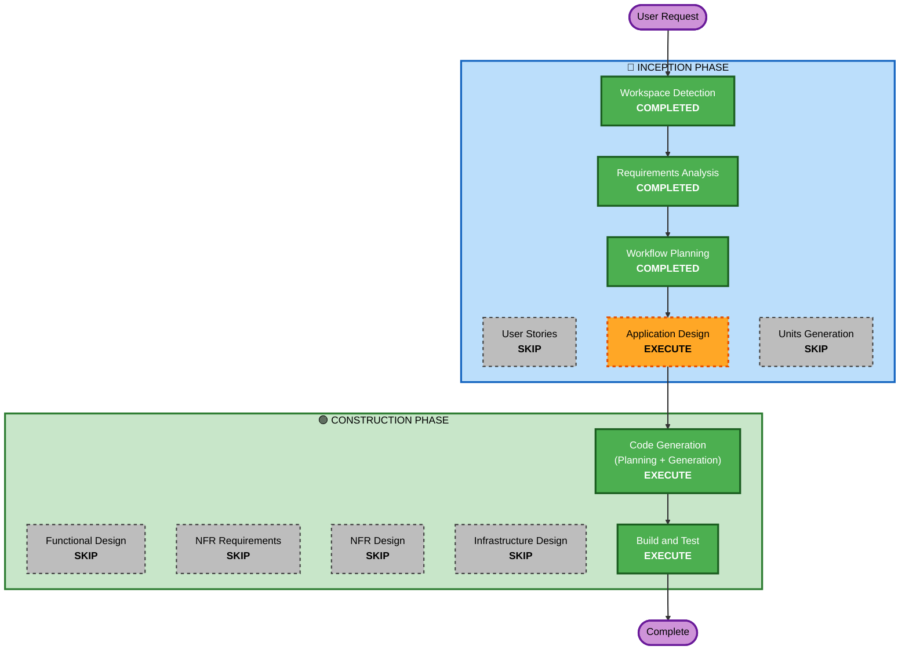

# Execution Plan

## Detailed Analysis Summary

### Change Impact Assessment
- **User-facing changes**: Yes — 새로운 웹 애플리케이션 전체 구축
- **Structural changes**: Yes — Frontend + Backend + DB 3-tier 구조 신규 생성
- **Data model changes**: Yes — User, TODO 테이블 신규 설계
- **API changes**: Yes — REST API 신규 설계 (Auth + TODO CRUD)
- **NFR impact**: No — PoC 수준, NFR 요구사항 없음

### Risk Assessment
- **Risk Level**: Low (Greenfield PoC, 잘 알려진 기술 스택)
- **Rollback Complexity**: Easy (신규 프로젝트)
- **Testing Complexity**: Simple (기본 CRUD + 인증)

## Workflow Visualization



### Text Alternative
```
Phase 1: INCEPTION
  - Workspace Detection (COMPLETED)
  - Requirements Analysis (COMPLETED)
  - Workflow Planning (COMPLETED)
  - User Stories (SKIP)
  - Application Design (EXECUTE)
  - Units Generation (SKIP)

Phase 2: CONSTRUCTION
  - Functional Design (SKIP)
  - NFR Requirements (SKIP)
  - NFR Design (SKIP)
  - Infrastructure Design (SKIP)
  - Code Generation (EXECUTE)
  - Build and Test (EXECUTE)
```

## Phases to Execute

### 🔵 INCEPTION PHASE
- [x] Workspace Detection (COMPLETED)
- [x] Requirements Analysis (COMPLETED)
- [x] Workflow Planning (COMPLETED)
- [ ] User Stories - EXECUTE
  - **Rationale**: 인증 기능 포함, 사용자 워크플로우 존재 (회원가입→로그인→TODO 관리→필터링), 스토리로 사용자 관점 요구사항 명확화 필요
- [ ] Application Design - EXECUTE
  - **Rationale**: Frontend/Backend 컴포넌트 구조, API 엔드포인트, DB 스키마 설계 필요
- [x] Units Generation - SKIP
  - **Rationale**: 단일 유닛으로 충분 (Frontend + Backend를 하나의 유닛으로 구현)

### 🟢 CONSTRUCTION PHASE
- [x] Functional Design - SKIP
  - **Rationale**: CRUD + 토글 + 필터링은 비즈니스 로직이 단순하여 별도 상세 설계 불필요
- [x] NFR Requirements - SKIP
  - **Rationale**: PoC 수준, NFR 요구사항 없음, 보안 Extension 미적용
- [x] NFR Design - SKIP
  - **Rationale**: NFR Requirements 미실행
- [x] Infrastructure Design - SKIP
  - **Rationale**: 로컬 개발 환경만 필요, 인프라 설계 불필요
- [ ] Code Generation - EXECUTE (ALWAYS)
  - **Rationale**: Part 1 계획 수립 → Part 2 코드 생성
- [ ] Build and Test - EXECUTE (ALWAYS)
  - **Rationale**: 빌드 및 테스트 가이드 생성

## Success Criteria
- **Primary Goal**: 동작하는 TODO List PoC 웹앱 구현
- **Key Deliverables**: React 프론트엔드, Express 백엔드 API, SQLite DB, JWT 인증
- **Quality Gates**: 앱 실행 가능, CRUD 동작, 로그인/로그아웃 동작, 필터링 동작
